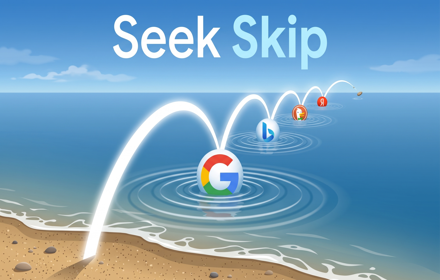
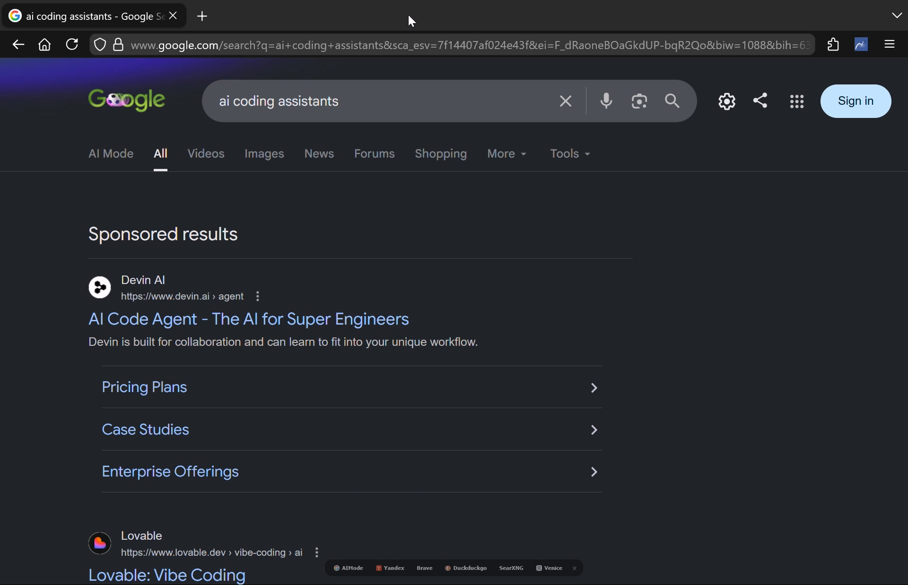
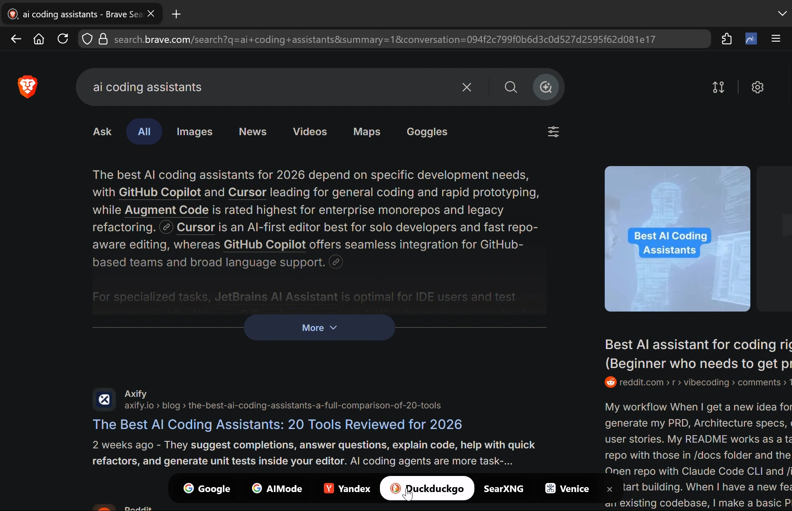
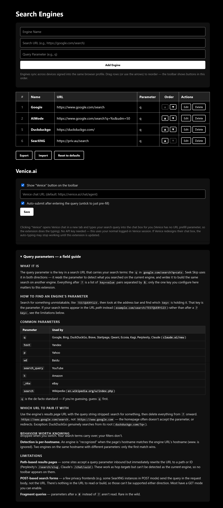

# Seek Skip

  

Hop the same search query between search engines with one click. When you run a
search, a compact toolbar appears at the bottom of the results page with a button
for each of your other configured engines — click one and the same query re-runs
there. Also hands queries off to [Venice.ai](https://venice.ai) chat.

## Features

### Toolbar
- Appears on any configured engine's results page, centred at the bottom.
- One button per engine (favicon + name), shown in the order set in Settings.
- **Dormant mode** — after you move the mouse, the toolbar shrinks to 50% size and
  50% opacity to stay out of the way:

  

- Hover to expand it back to full size:

  

- Tracks query changes on single-page-app engines (Google, Brave, DDG refine
  searches without a page load) so the buttons always carry your *current* query.
- Dismiss with the × until your next search.

### Engine management (Settings)

  

- Add, **edit in place**, delete, and reorder engines — drag rows or use the
  ▲/▼ arrows. Toolbar order mirrors list order.
- **Sync** — the engine list is stored in browser sync storage and follows you
  across devices signed into the same browser profile.
- **Export / Import** — engines export to a JSON file (hand-editable). Import
  offers replace-or-merge; merge de-duplicates against your existing list.
  Imports are validated: malformed entries and non-http(s) URLs are dropped.
- Built-in **query parameter field guide** explaining how to find any engine's
  parameter, common parameters (`q`, `text`, `p`, `wd`, …), and the cases that
  can't work (path-based results URLs, POST-only forms, fragment queries).

### Venice.ai integration
Venice has no URL prefill parameter, so the extension does the typing for you:

1. Click **Venice** on the toolbar.
2. Venice chat opens in a new tab (default: `https://venice.ai/chat/agent`,
   configurable).
3. The extension finds the chat composer and types your query in.
4. Depending on the **auto-submit** setting, it either sends the message or
   leaves it pre-filled for review.

No API key required — it uses your normal logged-in Venice session. Progress is
logged to the Venice tab's DevTools console under `[Seek Skip]` for easy
debugging. Because this is DOM automation against an unofficial surface, a
Venice UI redesign may break it until selectors are updated.

## Installation

### Firefox
Install from [Firefox Addons Store](https://addons.mozilla.org/en-US/firefox/addon/seek-skip/).

Manual Install:
1. Download `firefox.zip` from [releases](https://github.com/aiaiaioh/SeekSkip/releases/tag/v2.4.4).
2. Go to the addons manager (`about:addons`).
3. Click the settings icon and select `Install Add-on From File...`.
4. Select the downloaded `firefox.zip` file.

### Chromium (Chrome, Brave, Edge, Vivaldi, …)
1. Download `chromium.zip` from [releases](https://github.com/aiaiaioh/SeekSkip/releases/tag/v2.4.4) extract it.
2. Go to extensions manager `chrome://extensions` in browser and enable `Developer mode`.
3. Click `Load unpacked` and select the extracted `chromium` folder.

## Adding an engine

Each engine needs three things:

| Field | What it is | Example |
|---|---|---|
| Name | Button label | `Google` |
| URL | The engine's *results page* URL, query string stripped | `https://www.google.com/search` |
| Parameter | The query-string key that carries the search terms | `q` |

To discover an unknown engine's parameter: search for something unmistakable
(e.g. `TESTQUERY123`) and see which `key=` in the address bar holds it. The full
field guide lives at the bottom of the Settings page.

Default engines: Google, Yandex, Brave, DuckDuckGo, Claude (`claude.ai/new`,
outbound-only — Claude rewrites its URL after load, so no toolbar appears there).

## License

[MIT](LICENSE)
